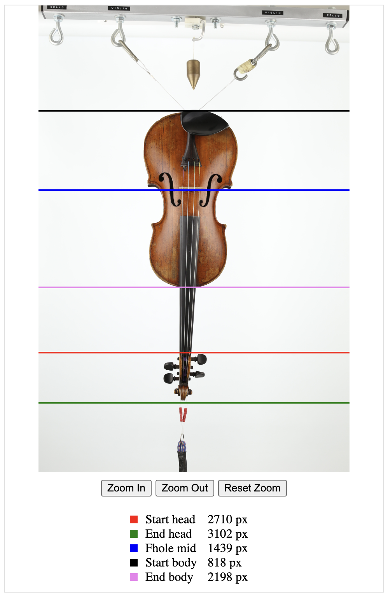

# VueJS Plotting UI Library

## Introduction

A plotting UI component made using VueJS.

## Demo

https://codesandbox.io/p/devbox/gallant-lamport-forked-24sy7v?workspaceId=b11e17e3-8d0d-4ee2-b2c0-556a8b41a6a0




## ⚡ Quick Start

Getting started with VueJS Plotting UI Library is easy. To add to your project, choose your package manager and run one of the following commands:

Using [npm](https://npmjs.com/)

```bash
npm install @snoofa-com/vue-plotting-ui-lib
```

## Usage

1. Import the component and its style

   ```ts
   import LinePlotter from "@snoofa-com/vue-plotting-ui-lib";
   import "@snoofa-com/vue-plotting-ui-lib/style.css";
   ```

2. Use it

   ```tsx
    <line-plotter
      :imageSource="imageSource"
      :lines="lines"
      :loading="loading"
      :handleDragStop="handleDragStop"
    />
   ```

3. See `example/App.vue` for more details

## npm

https://www.npmjs.com/package/@snoofa-com/vue-plotting-ui-lib
